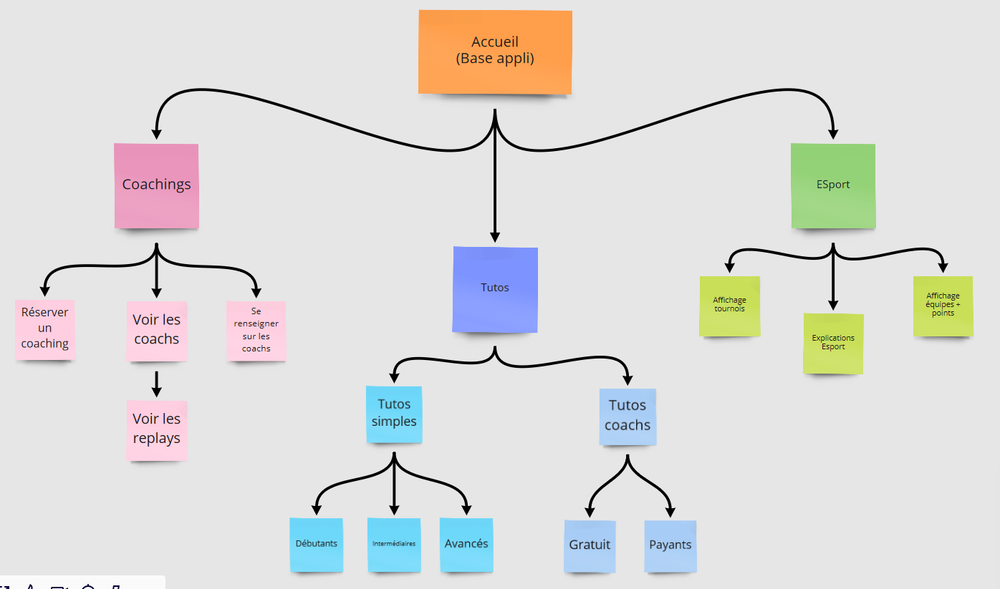
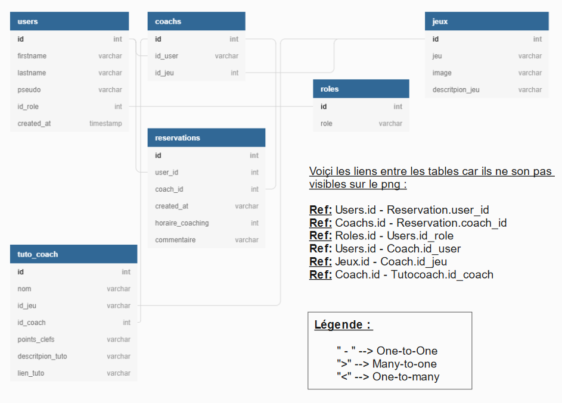

# GottaCoachThemAll
L'objectif de ce projet est de crée une application mobile sur laquelle on peut réserver des coachings de jeux vidéos, suivre des tutoriels, ou se renseigner sur divers aspect du e-sport, des compétitions, et des évènements à venir.

## Technologies choisies

Voici la liste des technilogies utilisées et à quel but.

|                |Techno                         |Interêt                      |Alternatives                 |
|----------------|-------------------------------|-----------------------------|-----------------------------|
|**Base de données** |`MySQL`                        |`C'est un outil qu'on connait très bien`          |`MariaDB, postgreSQL` --> `Non retenu car on péférais MySQL`          |
|**Api**           |`Express (API REST)`            |`On l'a déjà utilisé et il se lie bien avec React Native`|`graphQL`--> `On ne connaissais pas donc on a préféré utiliser une API Rest Express`      |
|**Application**    |`React Native`|`Crée une application mobile avec un laguage qu'on connait. Il permet de réutiliser ses composants pour faire un site web`           | `Ionic` --> `On connaissais bien, mais il est moins performant et plus difficile à passer en web`   |
|**Expo** |`Expo`                        |`Expo`          |`Expo`         |

## Documentation: Miro 

Vous retrouverez ici le miro du projet.
 Il contient : 
  >- La description du projet
  >- La definition du besoin
  >- Les tâches à effectuer
  >- Liste des fonctionnalitées
  >- Les maquettes
  >- Le Flow-Chart
  >- Le schema BDD

## Maquettes: AdobeXD 

Vous retrouverez ici les maquettes du projet sous adobeXD (document disponnible en ligne).
 Il contient le premier jet des maquettes: 
  >- Le menu
  >- La page d'accueil
  >- Le menu ouvert
  >- La liste des jeux
  >- Un template de liste de coachs
  >- Le template de la page perso des coachs

# Structure de l'application :
> ## Flowchart :
>

> ## Diagramme BDD :
>
